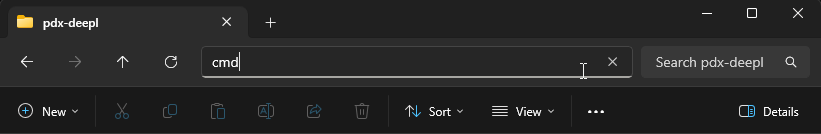

# Overview

**pdx-test-runner** is a tool to run scripted tests for games like Victoria 3 in a repeatable and configurable way.


## Contents

* [How does it work?](#how-does-it-work)
* [Configuration](#configuration)
    * [Attributes](#attributes)
    * [Example](#example-json-config)
* [Features](#features)
    * [Ignoring Files](#ignoring-files)
    * [Reporting](#reporting)
    * [Special Comments](#special-comments)
* [Usage](#usage)
    * [Usage Tip](#usage-tip)
* [How To Build](#how-to-build)

## Status

[](https://github.com/kaiser-chris/pdx-test-runner/actions/workflows/build.yaml)
[](https://github.com/kaiser-chris/pdx-test-runner/releases)

## How does it work?

The tool will run the game in a headless mode in the background without user intervention.

PDX games already have this functionality so why is this tool needed?

In short, it offers the following improvements to the base functionality:

- Full automation (by default the game will not close when all tests are completed)
- Allow ignoring existing tests from the base game (or other mods) to potentially improve runtime
- Collection of test result file and test failure save games in a central place
- Generation of a human-readable test report

## Configuration

The test runner is configured using a json file.

### Attributes

- **REQUIRED** `game-directory` path to the game directory
- **REQUIRED** `mod-directories`a list of mods that have tests and are currently loaded (needed for ignore feature and reporting)
- **OPTIONAL** `output-directory` directory where tests results and test failure save games are stored after the test
  run (default: `./output/`)
- **OPTIONAL** `move-save-games` whether to move (instead of copy) failure save games to the output folder (default:
  false)
- **OPTIONAL** `ignored-files` list of ignored scripted test files. for more information see (default: empty)

### Example JSON config

```json
{
  "game-directory": "X:\\Path\\To\\Game\\Base\\Folder",
  "mod-directories": [
    "X:\\Path\\To\\First\\Mod\\In\\Load\\Order",
    "X:\\Path\\To\\Second\\Mod\\In\\Load\\Order"
  ],
  "output-directory": "output",
  "move-save-games": true,
  "ignored-files": [
    "some_test_file.txt",
    "another_test_file.txt"
  ]
}
```

## Features

### Ignoring Files

Normally the game runs all scripted tests in the base game as well as all loaded mods.

In most cases we do not want to run every base game test or tests from other mods.
The test runner allows you to configure ignored files so not all tests are run everytime.

When the test runner starts it will parse all tests for reporting purposes
and if one of the test files matches an entry in the ignored file list it will rename the file.
So when the game runs its tests it will ignore the scripted test file
and after finishing the test run the test runner will restore it to the original name,
so it can be run again in the future.

### Reporting

After running the test runner will report test results in the console,
but will also write out a markdown report in the output directory.

An example report can be found here: [example_report.md](example_report.md)

### Special Comments

Tests and test files can be annotated with names and descriptions which will be reflected in the final test report.

This feature is totally optional and purely cosmetic.

Here is an example of an annotated scripted test:

```
### name = Name of the whole test file
last_date = "1936.1.1"

tests = {
    ### name = Name of specific test
    ### desc = Description of specific test
    some_test = {
        acceptable_fail_rate = 0.0
        success = {
            always = yes
        }
		fail = {
            always = no
        }
    }
}
```

## Usage

First download the latest release from the Releases page of the repository:

- https://github.com/kaiser-chris/pdx-test-runner/releases

> The ZIP may be marked as a *Virus*.
> This is a **false positive**!
>
> If you do not trust this, then you can [build](#how-to-build) it yourself.

Then you can run the application like this:

```
.\pdx-test-runner.exe"
```

> **NOTE** You need to run the game at least once before by directly starting the binary (exe) in the game folder.
> If this is not done, no DLCs are loaded!

All optional commands can be found in the help dialog. Help dialog (`.\pdx-test-runner.exe -h`):

```
Usage of pdx-test-runner:
  -config string
    	Optional: Path to test config (default "test-config.json")
  -report-ignored
    	Optional: Enable to list ignored tests in console
```

### Usage Tip

If you do not know how to open the command line on Windows:

- Open the folder containing the `pdx-test-runner.exe`
- Click into the top address bar of the explorer
- Clear it
- Write `cmd` and press enter
- Now you should have a command line window open



## How To Build

First download and install the Go SDK:

- https://go.dev/doc/install

Next, open the project folder in a terminal (e.g. cmd) and run the following command:

```
go build
```

That is it. There should be an executable in the project folder now.